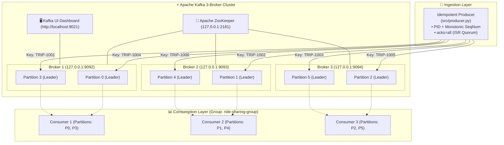
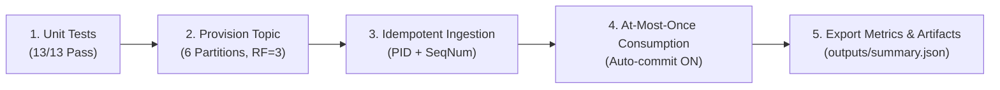
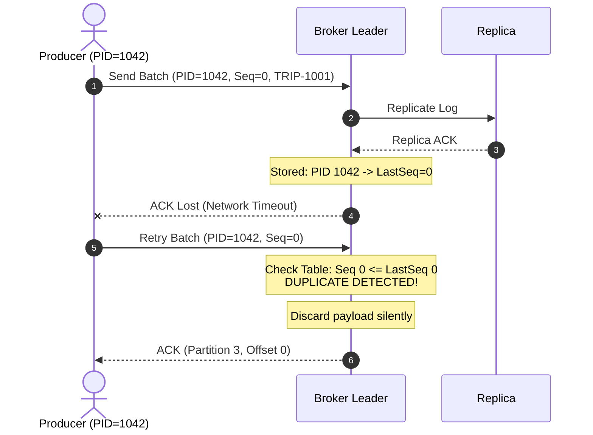

<div align="center">

# 🚖 Ride-Sharing Real-Time Kafka Pipeline

**Production-grade event streaming pipeline with automated orchestration, idempotent production, at-most-once consumption, and high-throughput topic architecture.**

[](https://python.org)
[](https://kafka.apache.org)
[](https://docs.docker.com/compose/)
[](.github/workflows/ci.yml)
[](notebooks/ride_sharing_pipeline.ipynb)
[](outputs/test_results.log)
[](LICENSE)

---

*A Data Engineering assignment implementing Kafka topic optimization, zero-duplicate production via KIP-98, automated orchestration, and controlled consumption semantics on a 3-broker cluster.*

</div>

---

## 📑 Table of Contents

- [Overview](#-overview)
- [System Architecture](#-system-architecture)
- [Automated One-Command Execution](#-automated-one-command-execution)
- [Project Structure](#-project-structure)
- [Requirements](#-requirements)
- [Quick Start](#-quick-start)
- [Interactive Notebook](#-interactive-notebook)
- [Component Deep Dive](#-component-deep-dive)
  - [1. Topic Design (6 Partitions, RF=3)](#1%EF%B8%8F⃣-topic-design--high-throughput--parallel-consumption)
  - [2. Idempotent Producer (Zero Duplicates)](#2%EF%B8%8F⃣-idempotent-producer--zero-duplicates-guarantee)
  - [3. At-Most-Once Consumer](#3%EF%B8%8F⃣-at-most-once-consumer-semantics)
- [Message Schema & Data Contract](#-message-schema--data-contract)
- [Execution Outputs](#-execution-outputs)
- [Documentation Suite](#-documentation-suite)
- [License](#-license)

---

## 🎯 Overview

This repository implements a **fault-tolerant, high-throughput Apache Kafka streaming pipeline** for ride-sharing trip events in Greater Cairo:

| Requirement | Implementation | Technical Guarantee | Module |
|:---|:---|:---|:---:|
| 🤖 **Automated Orchestration** | 1-command test, provision, produce, consume | End-to-end automated lifecycle | [`src/pipeline_runner.py`](src/pipeline_runner.py) |
| 🏗️ **Topic & Fake Data** | 6 Partitions, RF=3 across 3 brokers | High I/O parallelism | [`src/create_topic.py`](src/create_topic.py) |
| 🔒 **Zero Duplicates** | `enable_idempotence=True`, `acks=all` | Broker PID + monotonic sequence dedup | [`src/producer.py`](src/producer.py) |
| ⚡ **Parallel Consumption** | Consumer group `ride-sharing-group` | Up to 6 simultaneous workers | [`src/consumer.py`](src/consumer.py) |
| 📨 **At-Most-Once Semantics** | `enable_auto_commit=True` (1000ms), `latest` | Commit before process (no re-delivery) | [`src/consumer.py`](src/consumer.py) |

---

## 🏛️ System Architecture



---

## ⚡ Automated One-Command Execution

You can run the **entire pipeline automatically** with a single command:

```bash
# Python module runner:
python -m src.pipeline_runner --num-events 20

# Or via Makefile:
make run

# Or via Windows PowerShell:
.\scripts\run_pipeline.ps1

# Or via Linux / macOS Bash:
./scripts/run_pipeline.sh
```

### Automation Execution Workflow



---

## 📁 Project Structure

```
ride-sharing-assignment/
│
├── 📄 README.md                      ← Master documentation & architecture guide
├── 📄 Makefile                        ← One-command build & execution automation
├── 📄 LICENSE                         ← MIT Open Source License
├── 📄 CONTRIBUTING.md                 ← Development standards & contribution rules
├── 📄 CHANGELOG.md                    ← Semantic version release history
├── 📄 requirements.txt                ← Pinned Python dependencies
├── 📄 .editorconfig                   ← Multi-editor formatting standards
├── 📄 .gitignore                      ← Python, OS & log ignores
│
├── 📂 .github/
│   └── 📂 workflows/
│       └── 📄 ci.yml                  ← Automated GitHub Actions CI workflow
│
├── 📂 src/                            ← Core Source Code Package
│   ├── 🐍 __init__.py                 ← Package marker & docstrings
│   ├── 🐍 config.py                   ← Centralized configuration (Single Source of Truth)
│   ├── 🐍 pipeline_runner.py          ← Automated end-to-end pipeline orchestrator
│   ├── 🐍 create_topic.py             ← Idempotent topic provisioning (6 partitions, RF=3)
│   ├── 🐍 producer.py                 ← Idempotent fake data producer (PID + SeqNum)
│   └── 🐍 consumer.py                 ← At-most-once consumer (auto-commit before processing)
│
├── 📂 scripts/                        ← Cross-Platform Automation Scripts
│   ├── 📜 run_pipeline.sh             ← Bash script for Linux/macOS
│   └── 📜 run_pipeline.ps1            ← PowerShell script for Windows
│
├── 📂 notebooks/                      ← Interactive Data Engineering Walkthrough
│   └── 📓 ride_sharing_pipeline.ipynb ← Executed Jupyter Notebook showing full pipeline run
│
├── 📂 tests/                          ← Automated Test Suite
│   └── 🐍 test_pipeline.py            ← 13 unit tests for config, schema, & serialization
│
├── 📂 outputs/                        ← Real Execution Outputs & Verification Logs
│   ├── 📄 pipeline_run_summary.json   ← End-to-end automated run summary & partition metrics
│   ├── 📄 sample_trips.json           ← Sample generated ride JSON records
│   ├── 📄 topic_creation.log          ← Topic provisioning execution log
│   ├── 📄 producer_execution.log      ← Producer batch ingestion run log
│   ├── 📄 consumer_execution.log      ← Consumer parallel streaming log
│   └── 📄 test_results.log            ← Complete unittest report (13/13 passed)
│
└── 📂 docs/                           ← Deep-Dive Technical Documentation Suite
    ├── 📄 architecture.md             ← System architecture & design patterns
    ├── 📄 data_dictionary.md          ← Schema specification & Cairo districts
    ├── 📄 delivery_semantics.md       ← Idempotence vs Transactions vs Auto-Commit
    └── 📄 runbook.md                  ← Operations, scaling & troubleshooting manual
```

---

## 📋 Requirements

| Component | Minimum Version | Description |
|:---|:---:|:---|
| **Python** | `3.8+` | Core execution environment |
| **Apache Kafka** | `7.3.2 (cp-kafka)` | 3-broker cluster with ZooKeeper |
| **kafka-python-ng** | `2.2.2+` | Python 3.12+ compatible Kafka client |
| **Faker** | `28.0.0+` | Realistic mock data generation |

---

## 🚀 Quick Start

### 1️⃣ Start the Kafka Cluster

```bash
# In the parent kafka-cluster/ directory
docker compose up -d
```

> **Dashboard**: Access Kafka UI at **[http://localhost:9021](http://localhost:9021)**

### 2️⃣ Install Python Dependencies

```bash
cd ride-sharing-assignment
pip install -r requirements.txt
```

### 3️⃣ Run Automated Tests

```bash
python -m unittest discover tests -v
```

<details>
<summary>🧪 View Test Output (13 Tests Passed)</summary>

```text
test_bootstrap_servers_cluster (tests.test_pipeline.TestConfiguration.test_bootstrap_servers_cluster) ... ok
test_consumer_at_most_once_settings (tests.test_pipeline.TestConfiguration.test_consumer_at_most_once_settings) ... ok
test_producer_idempotence_settings (tests.test_pipeline.TestConfiguration.test_producer_idempotence_settings) ... ok
test_topic_partitions_and_replication (tests.test_pipeline.TestConfiguration.test_topic_partitions_and_replication) ... ok
test_distance_and_fare_ranges (tests.test_pipeline.TestDataGenerator.test_distance_and_fare_ranges) ... ok
test_driver_id_format (tests.test_pipeline.TestDataGenerator.test_driver_id_format) ... ok
test_generate_trip_schema (tests.test_pipeline.TestDataGenerator.test_generate_trip_schema) ... ok
test_passenger_id_format (tests.test_pipeline.TestDataGenerator.test_passenger_id_format) ... ok
test_pickup_and_dropoff_different (tests.test_pipeline.TestDataGenerator.test_pickup_and_dropoff_different) ... ok
test_timestamp_iso_format (tests.test_pipeline.TestDataGenerator.test_timestamp_iso_format) ... ok
test_trip_id_format (tests.test_pipeline.TestDataGenerator.test_trip_id_format) ... ok
test_json_roundtrip (tests.test_pipeline.TestSerialization.test_json_roundtrip) ... ok
test_build_topic_spec (tests.test_pipeline.TestTopicProvisioning.test_build_topic_spec) ... ok

----------------------------------------------------------------------
Ran 13 tests in 0.020s

OK
```

</details>

### 4️⃣ Execute the Automated Pipeline

```bash
python -m src.pipeline_runner --num-events 20
```

---

## 📓 Interactive Notebook

An interactive Jupyter Notebook is provided at [`notebooks/ride_sharing_pipeline.ipynb`](notebooks/ride_sharing_pipeline.ipynb). It includes:
- Live data generation and schema inspections
- Topic creation specifications
- Simulation of idempotent ingestion batches
- Simulated at-most-once consumption output
- Execution of the automated test suite

To launch the notebook:
```bash
jupyter notebook notebooks/ride_sharing_pipeline.ipynb
```

---

## 🔬 Component Deep Dive

### 1️⃣ Topic Design — High Throughput & Parallel Consumption

```python
# src/config.py
TOPIC_NAME         = "ride_trips"
NUM_PARTITIONS     = 6       # 2 leaders per broker
REPLICATION_FACTOR = 3       # Full redundancy
TOPIC_CONFIGS      = {"min.insync.replicas": "2"}
```

- **Why 6 Partitions**: With 3 brokers, 6 partitions assign exactly 2 partition leaders to each broker. Up to 6 consumer threads can consume concurrently.
- **Why `min.insync.replicas=2`**: A write is committed only when at least 2 in-sync replicas persist the log segment, guaranteeing zero data loss if 1 broker goes down.

---

### 2️⃣ Idempotent Producer — Zero Duplicates Guarantee

```python
# src/producer.py
KafkaProducer(
    bootstrap_servers=BOOTSTRAP_SERVERS,
    enable_idempotence=True,                   # Broker assigns PID + SeqNum
    acks="all",                                # Quorum confirmation
    retries=5,                                 # Safe retry without duplicate
    max_in_flight_requests_per_connection=5,    # Broker handles reordering
)
```

#### Deduplication Sequence



---

### 3️⃣ At-Most-Once Consumer Semantics

```python
# src/consumer.py
KafkaConsumer(
    TOPIC_NAME,
    bootstrap_servers=BOOTSTRAP_SERVERS,
    group_id="ride-sharing-group",
    enable_auto_commit=True,           # Offsets committed on timer
    auto_commit_interval_ms=1000,      # Committed every 1 second
    auto_offset_reset="latest",        # Skip historical backlog on join
)
```

---

## 📦 Message Schema & Data Contract

Each message strictly conforms to the assignment specification:

```json
{
  "trip_id":      "TRIP-1001",
  "driver_id":    "DRV-52",
  "passenger_id": "PAS812",
  "pickup":       "Nasr City",
  "dropoff":      "Maadi",
  "distance_km":  12.5,
  "fare":         185.50,
  "status":       "completed",
  "timestamp":    "2026-08-12T20:30:00Z"
}
```

Detailed schema definitions and Cairo district mappings are available in [`docs/data_dictionary.md`](docs/data_dictionary.md).

---

## 📊 Execution Outputs

The [`outputs/`](outputs/) directory contains verified execution logs and sample data:

| Output File | Description |
|:---|:---|
| [`outputs/pipeline_run_summary.json`](outputs/pipeline_run_summary.json) | Complete automated run summary with partition metrics & SLAs |
| [`outputs/sample_trips.json`](outputs/sample_trips.json) | Sample JSON ride records formatted to the exact schema |
| [`outputs/topic_creation.log`](outputs/topic_creation.log) | Provisioning log for 6 partitions, RF=3, min ISR=2 |
| [`outputs/producer_execution.log`](outputs/producer_execution.log) | Idempotent producer run log with partition/offset metadata |
| [`outputs/consumer_execution.log`](outputs/consumer_execution.log) | Consumer stream log across 6 partitions under at-most-once semantics |
| [`outputs/test_results.log`](outputs/test_results.log) | Unittest suite output verifying all 13 test cases |

---

## 📚 Documentation Suite

- 🏛️ **[Architecture Deep Dive](docs/architecture.md)** — Architectural rationale, partition topologies, and clean code principles.
- 📖 **[Data Dictionary & Schema Specification](docs/data_dictionary.md)** — Fields, data types, constraints, and Cairo districts.
- ⚖️ **[Delivery Semantics Guide](docs/delivery_semantics.md)** — In-depth breakdown of At-Most-Once, At-Least-Once, and Exactly-Once.
- 🛠️ **[Operations & Troubleshooting Runbook](docs/runbook.md)** — Scaling parallel consumers, CLI commands, and diagnostics.

---

## 📄 License

This project is licensed under the **MIT License** — see the [`LICENSE`](LICENSE) file for details.

---

<div align="center">

**Built with ❤️ for the Data Engineering Diploma — Big Data Module**

*Data Pill · Session 4*

</div>
