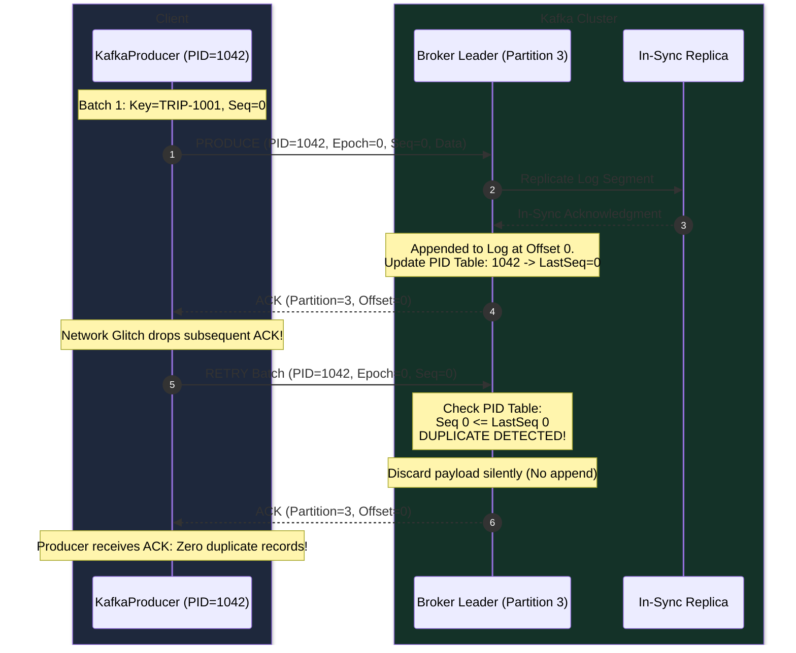
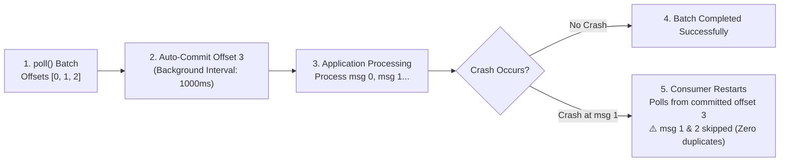
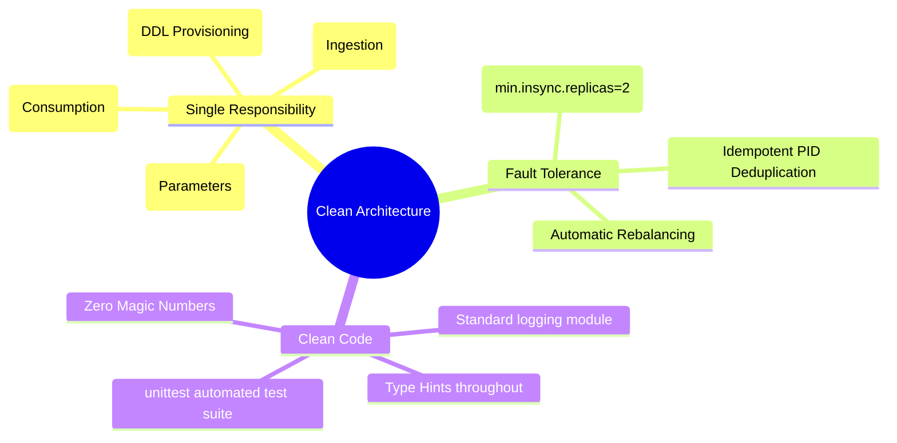

# 🏛️ Architecture & System Design Deep Dive

This document provides an in-depth technical explanation of every architectural decision, data flow, and failure-handling model in the **Ride-Sharing Kafka Pipeline**.

---

## 1. End-to-End System Architecture

```mermaid
flowchart TB
    subgraph ClientLayer["🚖 Ingestion Layer"]
        P["Idempotent Producer<br/>(src/producer.py)<br/>• enable_idempotence=True<br/>• acks=all<br/>• PID + Monotonic SeqNum"]
    end

    subgraph KafkaCluster["⚡ Apache Kafka 3-Broker Cluster (Docker Network: itvdelabnw)"]
        subgraph Broker1["Broker 1 (kafka1:9092)"]
            B1_P0["Partition 0 (Leader)"]
            B1_P3["Partition 3 (Leader)"]
            B1_R1["Partition 1 (Replica)"]
            B1_R2["Partition 2 (Replica)"]
        end

        subgraph Broker2["Broker 2 (kafka2:9093)"]
            B2_P1["Partition 1 (Leader)"]
            B2_P4["Partition 4 (Leader)"]
            B2_R0["Partition 0 (Replica)"]
            B2_R3["Partition 3 (Replica)"]
        end

        subgraph Broker3["Broker 3 (kafka3:9094)"]
            B3_P2["Partition 2 (Leader)"]
            B3_P5["Partition 5 (Leader)"]
            B3_R4["Partition 4 (Replica)"]
            B3_R5["Partition 5 (Replica)"]
        end

        ZK["🐘 Apache ZooKeeper (zoo1:2181)<br/>Cluster Metadata & Consensus"]
        UI["🖥️ Kafka UI (localhost:9021)<br/>Cluster Observability Dashboard"]
    end

    subgraph ConsumerLayer["📊 Consumption Layer (Group: ride-sharing-group)"]
        C1["Consumer Instance 1<br/>• Partitions: P0, P3<br/>• At-Most-Once Auto-Commit"]
        C2["Consumer Instance 2<br/>• Partitions: P1, P4<br/>• At-Most-Once Auto-Commit"]
        C3["Consumer Instance 3<br/>• Partitions: P2, P5<br/>• At-Most-Once Auto-Commit"]
    end

    P -->|Key: trip_id (hash % 6)| B1_P0
    P -->|Key: trip_id (hash % 6)| B2_P1
    P -->|Key: trip_id (hash % 6)| B3_P2
    P -->|Key: trip_id (hash % 6)| B1_P3
    P -->|Key: trip_id (hash % 6)| B2_P4
    P -->|Key: trip_id (hash % 6)| B3_P5

    B1_P0 -.->|Fetch Data| C1
    B1_P3 -.->|Fetch Data| C1
    B2_P1 -.->|Fetch Data| C2
    B2_P4 -.->|Fetch Data| C2
    B3_P2 -.->|Fetch Data| C3
    B3_P5 -.->|Fetch Data| C3

    ZK --- Broker1
    ZK --- Broker2
    ZK --- Broker3
    UI --- Broker1
```

---

## 2. Topic Design Rationale

### 2.1 Partition Topology & Load Distribution

```mermaid
gantt
    title Partition Leader Distribution (6 Partitions across 3 Brokers)
    dateFormat  X
    axisFormat %s
    section Broker 1
    Partition 0 (Leader) :0, 10
    Partition 3 (Leader) :0, 10
    section Broker 2
    Partition 1 (Leader) :0, 10
    Partition 4 (Leader) :0, 10
    section Broker 3
    Partition 2 (Leader) :0, 10
    Partition 5 (Leader) :0, 10
```



| Dimension | Configured Value | Engineering Rationale |
|:---|:---:|:---|
| **Partitions** | `6` | 3 brokers × 2 leaders per broker ensures uniform write/read distribution. Allows scaling up to 6 parallel consumers. |
| **Replication Factor** | `3` | Full redundancy across all brokers in the cluster. Every partition has 1 leader and 2 in-sync followers. |
| **`min.insync.replicas`** | `2` | Guarantees that at least 2 brokers acknowledge any append before returning success, preventing data loss on single broker crash. |

---

## 3. Idempotent Producer — Zero Duplicates Protocol



---

## 4. At-Most-Once Consumption Mechanics



---

## 5. Software Engineering Clean Code Principles Applied


