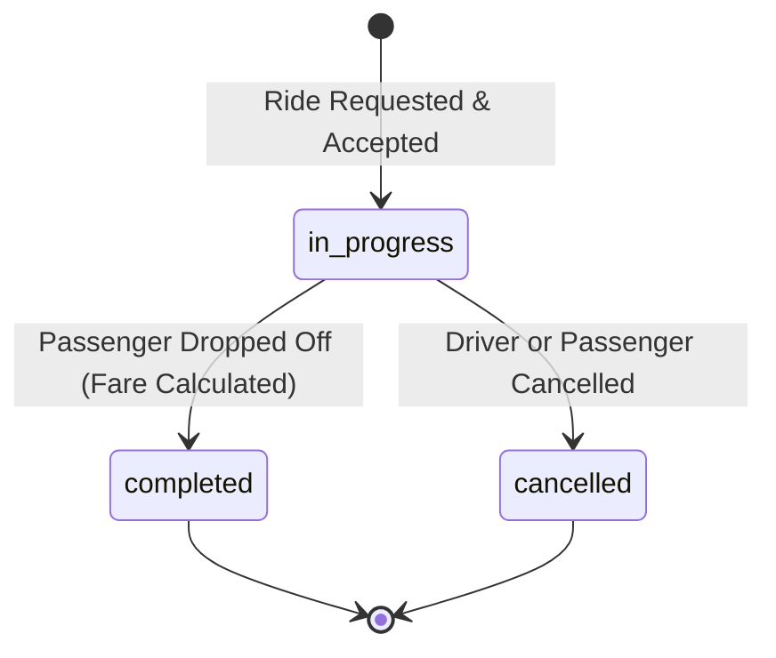

# 📖 Data Dictionary & Schema Specification

This document defines the schema, data types, validation rules, and geographic coverage for all messages produced and consumed in the **Ride-Sharing Kafka Pipeline**.

---

## 📋 Message Schema Specification

Each ride event is published as a JSON payload to the `ride_trips` topic.

```json
{
  "trip_id": "TRIP-1001",
  "driver_id": "DRV-52",
  "passenger_id": "PAS812",
  "pickup": "Nasr City",
  "dropoff": "Maadi",
  "distance_km": 12.5,
  "fare": 185.50,
  "status": "completed",
  "timestamp": "2026-08-12T20:30:00Z"
}
```

---

## 🏷️ Field Definitions & Constraints

| Field | Type | Required | Kafka Key | Constraint / Format | Description |
|:---|:---:|:---:|:---:|:---|:---|
| `trip_id` | `string` | **Yes** | **Yes** | Pattern: `^TRIP-[0-9]+$` | Unique identifier for the trip. Serves as the Kafka message partition key. |
| `driver_id` | `string` | **Yes** | No | Pattern: `^DRV-[0-9]+$` | Identifier for the assigned driver (1 – 100). |
| `passenger_id` | `string` | **Yes** | No | Pattern: `^PAS[0-9]{3}$` | Identifier for the requesting passenger (100 – 999). |
| `pickup` | `string` | **Yes** | No | One of valid Cairo areas | Departure neighborhood/area in Greater Cairo. |
| `dropoff` | `string` | **Yes** | No | One of valid Cairo areas | Destination neighborhood/area (guaranteed `pickup != dropoff`). |
| `distance_km` | `float` | **Yes** | No | Range: `[1.0, 35.0]`, precision `1` | Traveled route distance in kilometers. |
| `fare` | `float` | **Yes** | No | Range: `[25.00, 350.00]`, precision `2` | Total trip fare in Egyptian Pounds (EGP). |
| `status` | `string` | **Yes** | No | `completed` \| `in_progress` \| `cancelled` | Current lifecycle state of the ride trip. |
| `timestamp` | `string` | **Yes** | No | ISO 8601 UTC: `YYYY-MM-DDTHH:MM:SSZ` | Event generation timestamp in Coordinated Universal Time. |

---

## 🗺️ Greater Cairo Geographic Coverage

Pickups and dropoffs are sampled from 15 major Greater Cairo districts:

| Region / Governorate | Supported Areas / Districts |
|:---|:---|
| **Cairo Governorate (East)** | Nasr City, Heliopolis, New Cairo, Rehab City, Tagamoa, Ain Shams |
| **Cairo Governorate (Central)** | Downtown, Zamalek, Shubra |
| **Giza Governorate** | Dokki, Mohandessin, Giza |
| **6th of October Zone** | 6th October, Sheikh Zayed |
| **South Cairo** | Maadi |

---

## 🔄 Trip Status Lifecycle



---

## 🔑 Partition Key Strategy

- **Key Field**: `trip_id`
- **Hash Function**: MurmurHash2 (`org.apache.kafka.common.utils.Utils.toPositive(Utils.murmur2(keyBytes)) % numPartitions`)
- **Ordering Guarantee**: All lifecycle state transitions for a specific `trip_id` are guaranteed to land on the **same partition**, ensuring deterministic chronological processing by downstream consumers.
