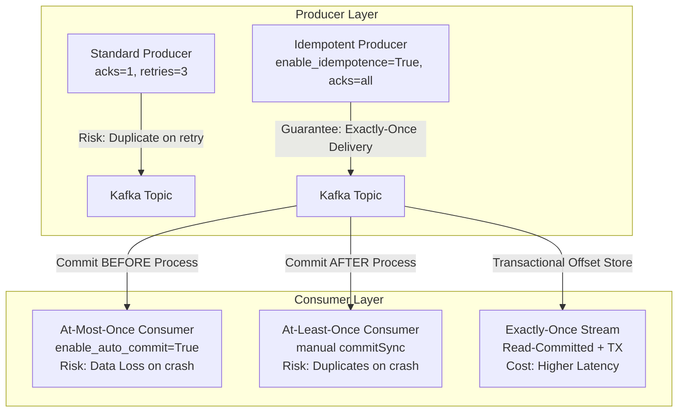
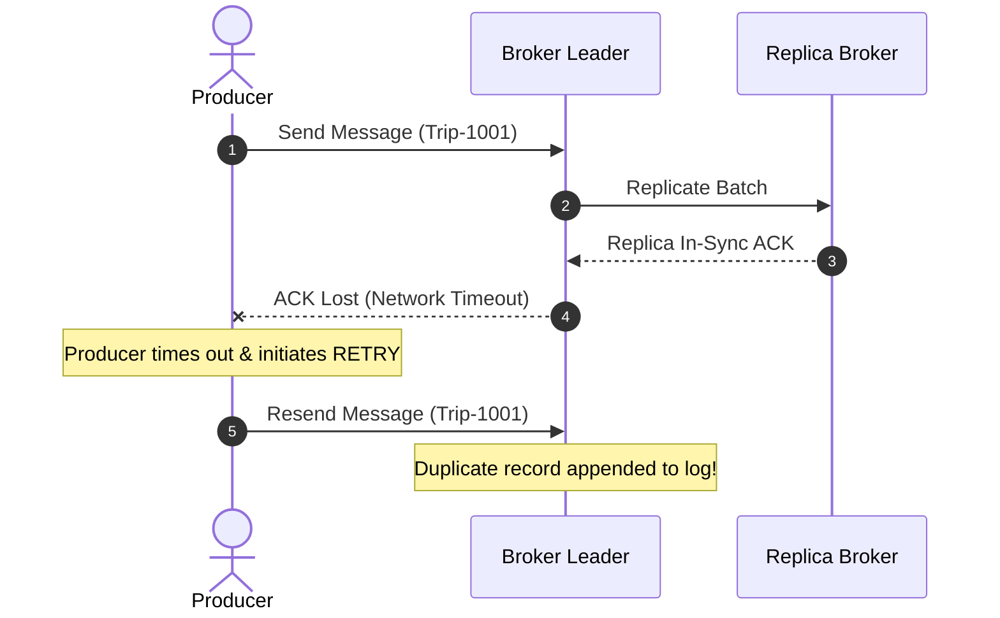
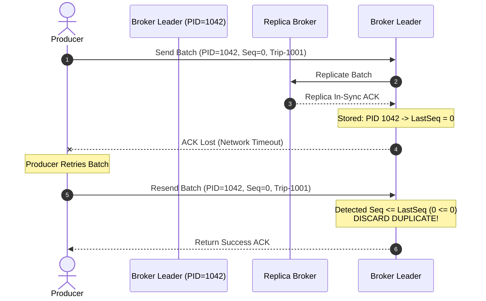
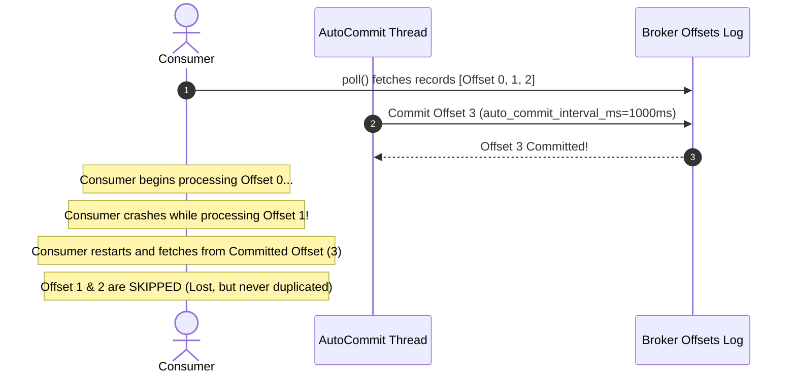

# ⚖️ Kafka Delivery Semantics & Idempotence Guide

This guide details the theoretical foundation, configuration matrix, and operational trade-offs of messaging semantics in Apache Kafka, with specific reference to this ride-sharing pipeline.

---

## 📊 Messaging Semantics Matrix

---

## 🔒 1. Producer Idempotence (KIP-98)

### Problem: Transient Network Failures Cause Duplicate Writes

Without idempotency, when a producer transmits a batch to a broker and the broker writes it to disk but the **ACK packet is dropped in the network**, the producer assumes failure and retries. This causes the broker to append the record a second time.

---

### Solution: Idempotent Producer Protocol

When `enable_idempotence=True` is activated:

1. **InitProducerId**: On initialization, the producer receives an 8-byte **Producer ID (PID)** and an epoch from the cluster coordinator.
2. **Monotonic Sequence Numbers**: Every batch sent by the producer to a specific partition is assigned a zero-indexed sequence number (`0, 1, 2, ...`).
3. **Broker Deduplication State**: The broker leader tracks the highest sequence number written per `PID` for each partition. If a received sequence number equals or precedes the highest recorded sequence number, the broker **silently discards the duplicate** while still returning a success ACK.

---

## 📨 2. At-Most-Once Consumption

### Mechanism

At-most-once reading ensures a record is processed **at most 1 time** (either 0 or 1). It guarantees that duplicates will **never** be processed by the consumer application.

---

## ⚙️ Configuration Comparison Matrix

| Parameter | At-Most-Once (Our Setup) | At-Least-Once | Exactly-Once (EOS) |
|:---|:---:|:---:|:---:|
| `enable_auto_commit` | `True` | `False` | `False` |
| `auto_commit_interval_ms` | `1000` | N/A | N/A |
| `auto_offset_reset` | `latest` | `earliest` | `earliest` |
| `isolation_level` | `read_uncommitted` | `read_uncommitted` | `read_committed` |
| **Throughput** | ⚡⚡⚡ Highest | ⚡⚡ High | ⚡ Moderate |
| **Risk** | Message Loss on crash | Duplicate processing | Latency overhead |
