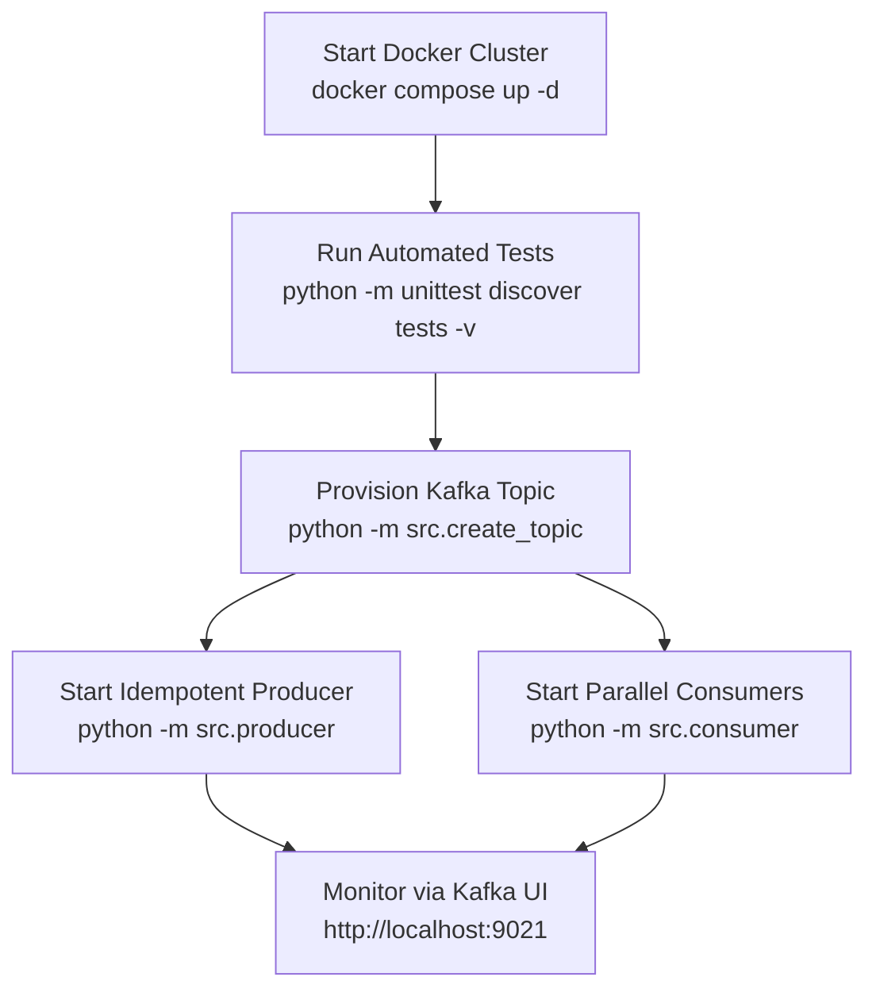
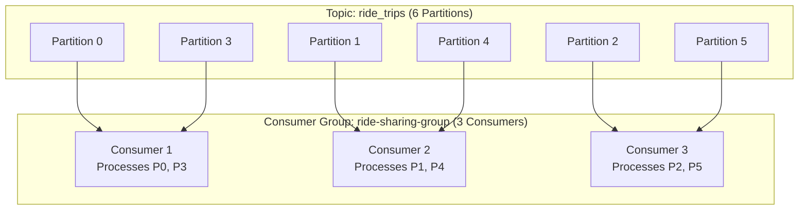

# 🛠️ Operations & Troubleshooting Runbook

This runbook contains operational procedures, scaling instructions, monitoring steps, and disaster recovery commands for the **Ride-Sharing Kafka Pipeline**.

---

## 🚀 Standard Operations Workflow



---

## 👥 Scaling to Parallel Consumers

Because `ride_trips` is partitioned into **6 partitions**, you can run up to **6 parallel consumer instances** under the same consumer group `ride-sharing-group`.



### Command: Launching 3 Parallel Consumers in Separate Terminals

```bash
# Terminal 1:
python -m src.consumer

# Terminal 2:
python -m src.consumer

# Terminal 3:
python -m src.consumer
```

Kafka's Group Coordinator will automatically trigger a **group rebalance** and assign 2 partitions to each consumer instance.

---

## 🔍 Verification & Inspection via CLI

### 1. Inspect Topic Configuration & Partitions

```bash
docker exec kafka1 kafka-topics --bootstrap-server kafka1:19092 --describe --topic ride_trips
```

**Expected Output:**
```text
Topic: ride_trips	TopicId: ...	PartitionCount: 6	ReplicationFactor: 3	Configs: min.insync.replicas=2
	Topic: ride_trips	Partition: 0	Leader: 1	Replicas: 1,2,3	Isr: 1,2,3
	Topic: ride_trips	Partition: 1	Leader: 2	Replicas: 2,3,1	Isr: 2,3,1
	Topic: ride_trips	Partition: 2	Leader: 3	Replicas: 3,1,2	Isr: 3,1,2
	Topic: ride_trips	Partition: 3	Leader: 1	Replicas: 1,3,2	Isr: 1,3,2
	Topic: ride_trips	Partition: 4	Leader: 2	Replicas: 2,1,3	Isr: 2,1,3
	Topic: ride_trips	Partition: 5	Leader: 3	Replicas: 3,2,1	Isr: 3,2,1
```

### 2. Inspect Consumer Group Lag & Offsets

```bash
docker exec kafka1 kafka-consumer-groups --bootstrap-server kafka1:19092 --describe --group ride-sharing-group
```

---

## 🩺 Troubleshooting Guide

| Symptom | Probable Cause | Remediation |
|:---|:---|:---|
| `NoBrokersAvailable` | Docker ports not reachable or IPv6 resolution issue | Ensure `BOOTSTRAP_SERVERS` uses `127.0.0.1` IPv4 and containers are running via `docker ps`. |
| `NotEnoughReplicasException` | Less than 2 brokers in ISR | Start failed broker containers: `docker compose up -d`. |
| Consumer receiving no data | Cold start with `auto_offset_reset="latest"` | Start the producer after the consumer is running, or switch `auto_offset_reset` to `earliest`. |
| `TopicExistsException` | Topic already provisioned | Expected behavior. `src/create_topic.py` gracefully catches and skips this error. |
